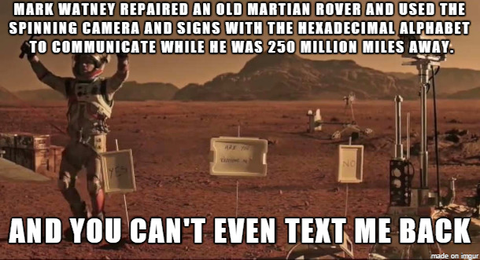
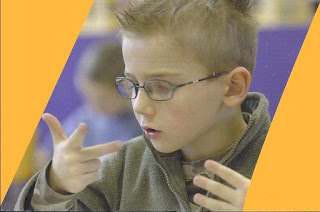
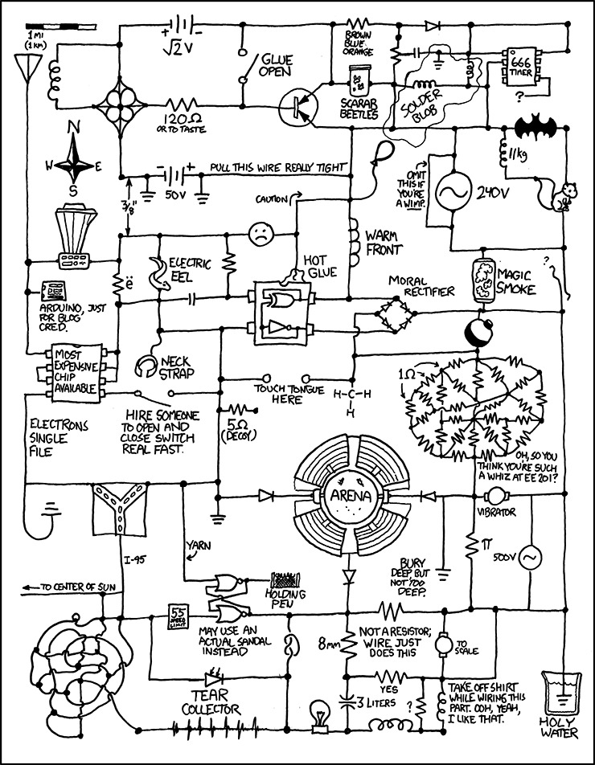

# Informatique

## SNΤ ???

Première chose à faire : oublier cette appellation idiote... ScienceS ?  Numériques ? et
technologie ????

Non !!  Vous avez des  cours d'histoire,  d'anglais, de maths.  Aujourd'hui nous
commençons un nouveau cours d'**INFORMATIQUE**.

Peu de gens  sont au courant mais il y  a en effet un nouveau truc  qui vient de
sortir  et qui  s'appelle  *in-for-ma-tique*.  La France  vient  de  le découvrir  et
l'introduit à l'école:


Pendant ce temps, ailleurs dans le monde...


## Informatique ???

Au fait, l'informatique c'est quoi ?

C'est par exemple ça:


[](https://www.youtube.com/embed/jpfHxfF-Kno "Le
scaphandre et le papillon")

ou en version plus blockbuster:

[](https://www.youtube.com/embed/ffB0Je-xjKg "The Martian")


L'**informati**que c'est LΑ *SCIENCΕ* DΕ L'**INFORMATI**ON


Les physicien(ne)s traitent d'énergie, d'ondes, de matières:


Les informaticien(ne)s traitent d'information.

## Pause : information ?

Choisissez un nombre entre 0 et 127. 

Je peux poser autant  de questions que je veux mais vous  ne pouvez répondre que
par oui ou non (et ne pas mentir...)

Combien de questions dois-je poser au maximum pour deviner le nombre ?

Je pourrais commencer par "Est-ce 0 ? Est-ce 1 ? Est-ce 2 ?"... Y a-t-il plus efficace?

## Computer science ?

Edsger Dijkstra (Prix Turing 1972) : 

>"*I don't need to waste my time with a computer just because I am a computer scientist*"


Michael R. Fellows :

>"*Computer science is no more about computers than astronomy
>is about telescopes, biology is about  microscopes or chemistry is about beakers
>and test tubes. Science is not about tools, it is about how we use them and what
>we find out when we do.*"

Jean-Claude Simon : 

>"*Négligeant ou ignorant les aspects intellectuels de l'informatique, certains sont sincèrement convaincus que l'informatique n'est pas une nouvelle discipline, mais seulement une nouvelle technique.*"


Daniel Garric : 

>"*Pour tout ce qui est caractérisé par l'informatique ou qui
>caractérise  l'informatique, l'ordinateur  n'est pas  toujours nécessaire.  Mais
>l'esprit informatique l'est, la décomposition de chaque problème général en sous
>problèmes et leur réorganisation dynamique, les uns en fonction des autres*"


## Numérique ? Digital ?




L'atome de l'informatique est la  logique, pas les nombres. Toute l'informatique
se construit à partir de portes logiques, conceptuellement comme en pratique:




## Beauté


>If you can keep your head when all about you   
>    Are losing theirs and blaming it on you,   
>If you can trust yourself when all men doubt you,
>    But make allowance for their doubting too;   
>
> If you can wait and not be tired by waiting,
>     Or being lied about, don’t deal in lies,
> Or being hated, don’t give way to hating,
>     And yet don’t look too good, nor talk too wise:
>
> If you can dream—and not make dreams your master;   
>     If you can think—and not make thoughts your aim;   
> If you can meet with Triumph and Disaster
>     And treat those two impostors just the same;   
> If you can bear to hear the truth you’ve spoken
>     Twisted by knaves to make a trap for fools,
> Or watch the things you gave your life to, broken,
>     And stoop and build ’em up with worn-out tools:
>
> If you can make one heap of all your winnings
>     And risk it on one turn of pitch-and-toss,
> And lose, and start again at your beginnings
>     And never breathe a word about your loss;
> If you can force your heart and nerve and sinew
>     To serve your turn long after they are gone,   
> And so hold on when there is nothing in you
>     Except the Will which says to them: ‘Hold on!’
>
> If you can talk with crowds and keep your virtue,   
>     Or walk with Kings—nor lose the common touch,
> If neither foes nor loving friends can hurt you,
>     If all men count with you, but none too much;
> If you can fill the unforgiving minute
>     With sixty seconds’ worth of distance run,   
> Yours is the Earth and everything that’s in it,   
>     And—which is more—you’ll be a Man, my son!
	
Rudyard Kipling


	
	

> Le papillon bat des ailes
> Comme s'il désespérait
> De ce monde.

Kobayashi Issa

```python
if x == 1:
   print(x)
else if x == 2 :
   print(x)
else if x == 3 :
   print(x)
else if x == 4 :
   print(x)
else if x == 5 :
   print(x)
else if x == 6 :
   print(x)
else if x == 7 :
   print(x)
else if x == 8 :
   print(x)
else if x == 9 :
   print(x)
else if x == 10 :
   print(x)
else:
   print(x)
```


```python
print(x)
```
