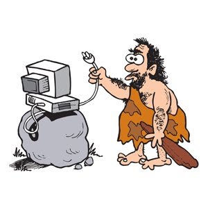
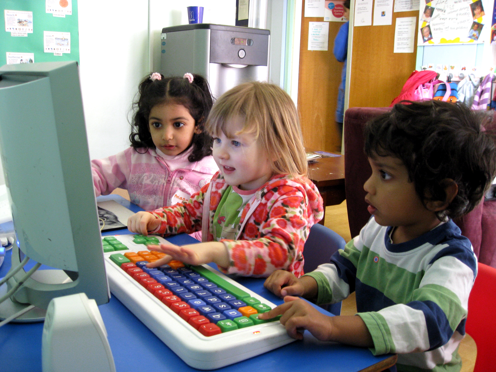
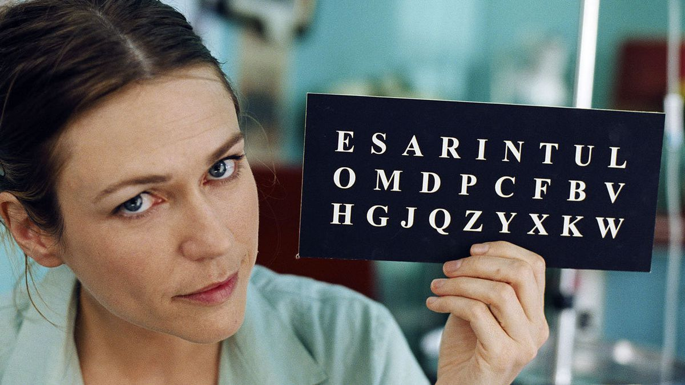
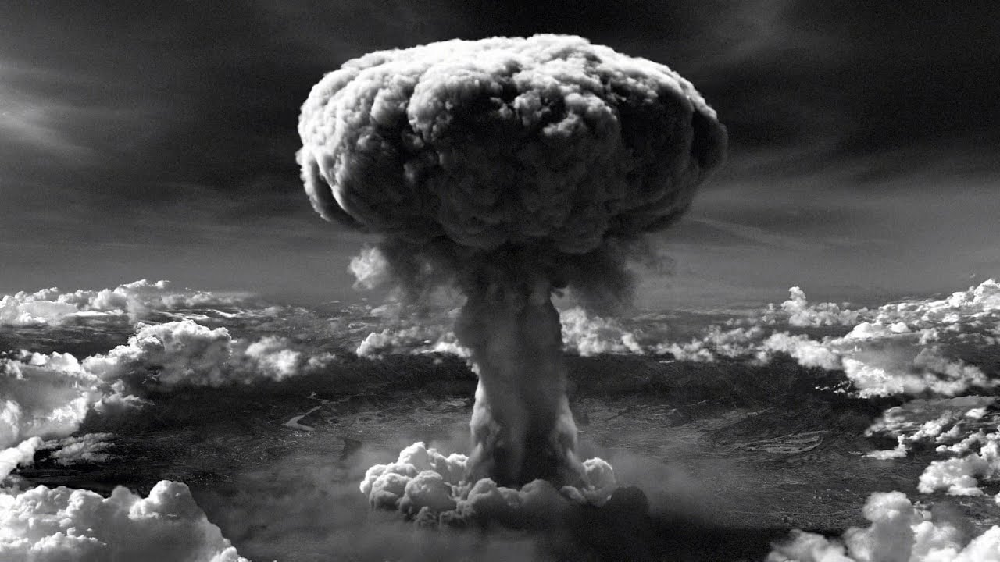

# Informatique

## SNΤ ???

Première chose à faire : oublier cette appellation idiote... ScienceS ?  Numériques ? et
technologie ????

Non !!  Vous avez des  cours d'histoire,  d'anglais, de maths.  Aujourd'hui nous
commençons un nouveau cours d'**INFORMATIQUE**.

Peu de gens  sont au courant mais il y  a en effet un nouveau truc  qui vient de
sortir  et qui  s'appelle  *in-for-ma-tique*.  La France  vient  de  le découvrir  et
l'introduit à l'école:

Pendant ce temps, ailleurs dans le monde...

## Informatique ???

Au fait, l'informatique c'est quoi ?

C'est par exemple ça:

ou en version plus blockbuster:

[![martian.png]](https://youtu.be/ffB0Je-xjKg "The Martian")

L'**informati**que c'est LΑ *SCIENCΕ* DΕ L'**INFORMATI**ON

Le physicien traite d'énergie, d'ondes, de matières:

