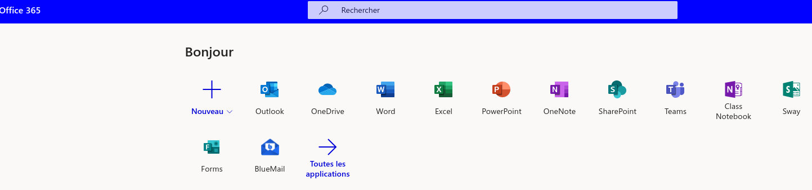

# Projet OSM

Ce projet  se déroule sur  trois semaines. À l'issue  de ces trois  séances vous
devrez avoir  produit un  compte-rendu de  vos travaux.  Il pourra  s'agir d'un
texte illustré  (au format PDF) et/ou  d'un diaporama (au format  PDF) et/ou une
vidéo et/ou une page web.

Votre  production doit  présenter  votre  activité tout  au  long  de ces  trois
semaines.

Les questions et les idées proposées ci-dessous  ne sont que des pistes. Libre à
vous de vous en inspirer.

Vous travaillez en équipe de deux.  Dans votre compte-rendu figurera entre autre
le "qui a fait quoi".

Vous ferez figurer les sources documentaires dans une bibliographie.

Le contexte : vous  êtes une équipe en entreprise et vous  devez présenter à vos
collègues qui ne connaissent pas ce qu'est OSM, ce que l'on peut faire avec, etc.


## Travailler en équipe sur un projet

Les outils présents sur votre compte (Office 365)[https://www.office.com/] :



Plusieurs outils utiles pour ce projet :

* SharePoint : créez  une page pour votre projet où  seront inscrits les membres
  de votre groupe (via leur  adresse `notre-dame-reze.fr`). Vous pourrez dans un
  premier  temps créer  un site  d'équipe  pour **organiser  votre travail**  et
  pourquoi  pas un  site de  communication  pour présenter  votre travail.  Vous
  disposerez par exemple d'une adresse  de messagerie pour travailler ensemble à
  distance.
  
  
* Les  outils habituels du  pack office de  Microsoft. Chaque document  que vous
  créez  est automatiquement  enregistré sur  votre drive  (`OneDrive`) pour  le
  retrouver à tout moment depuis n'importe où sur terre.
  
*  Lors  de  vos  recherches  sur  internet,  stockez  les  adresses  des  sites
  intéressants   dans   des   marque-pages.   Vous   veillerez   à   créer   des
  sous-répertoires de marque-pages  pour que tout soit bien  classé (par exemple
   `/INFO/2019_20/PROJET1_OSM/`)
   
  
  

## Découvrir OSM

Qu'est-ce qu'OSM  ? Quel est son  principe de fonctionnement ?  Comparaison avec
Google Maps.

Explorez  le   [Wiki](https://wiki.openstreetmap.org/wiki/Main_Page).  Qu'est-ce
qu'un Wiki ?

Ouvrez un compte sur OSM.

## GPS/Galileo

Comment sont  repérés les points de  la carte ?  Qu'est-ce que GPS ?  Galileo ?


## Contribuer ?

Le lycée est mal référencé sur OSM. Si ce n'est déjà fait, corriger ce
problème. 

Trouvez d'autres problèmes  à Rezé ou dans un autre  endroit que vous connaissez
bien et corrigez-les. Complétez des informations incomplètes.


## Overpass Turbo

Qu'est-ce qu'Overpass Turbo ? 

Voici un exemple de requête :

```c
[out:json][timeout:2500];
area[name="Pays de la Loire"][admin_level=4][boundary=administrative] -> .loc2;
(
  way["amenity"="school"]["operator:type"="private"]["school:FR"="lycée"](area.loc);
);
out center;
```

Que fait-elle ? Créez d'autres requêtes et présentez leurs résultats.

Cliquez sur l'onglet `Données` : commentez. Qu'est-ce que `JSON` ?
